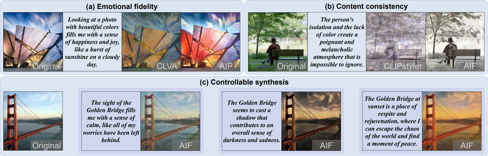

# Affective Image Filter: Reflecting Emotions from Text to Images （AIFormer）

This is the official implementation of [AIFormer](https://openaccess.thecvf.com/content/ICCV2023/papers/Weng_Affective_Image_Filter_Reflecting_Emotions_from_Text_to_Images_ICCV_2023_paper.pdf) (ICCV 2023)


## Abstract
Understanding the emotions in text and presenting them visually is a very challenging problem that requires a deep understanding of natural language and high-quality image synthesis simultaneously. In this work, we propose Affective Image Filter (AIF), a novel model that is able to understand the visually-abstract emotions from the text and reflect them to visually-concrete images with appropriate colors and textures. We build our model based on the multi-modal transformer architecture, which unifies both images and texts into tokens and encodes the emotional prior knowledge. Various loss functions are proposed to understand complex emotions and produce appropriate visualization. In addition, we collect and contribute a new dataset with abundant aesthetic images and emotional texts for training and evaluating the AIF model. We carefully design four quantitative metrics and conduct a user study to comprehensively evaluate the performance, which demonstrates our AIF modeloutperforms state-of-the-art methods and could evoke specific emotional responses from human observers.




## Prerequisites
* Python 3.8.0
* PyTorch 1.13.0
* NVIDIA GPU + CUDA cuDNN


## Installation
Clone this repo: 
```
https://github.com/zpx0922/AIFormer.git
```
Install PyTorch and dependencies
```
http://pytorch.org
```
Install other python requirements
```
pip install -r requirement.txt
```

## Dataset
Download the content([COCO2014](https://cocodataset.org/)) datasets.

Download the style ([style image](https://paperswithcode.com/dataset/wikiart)) datasets.

Download the description ([Affective description](https://drive.google.com/drive/folders/1O2OySL9v0ha4m6EqtbLfePURnIDEawk0?usp=drive_link)) datasets.

Download the affective prior ([VAD dictionary](https://drive.google.com/file/d/1v21PRc4XwhHWmWLOQ1g_G3HzqE-mNG8B/view?usp=drive_link)) datasets.


## Testing
Pretrained models: [vgg](https://drive.google.com/file/d/1BinnwM5AmIcVubr16tPTqxMjUCE8iu5M/view?usp=sharing),  [embedding](https://drive.google.com/file/d/1JNRoTdSyQ6yJok6DbeBZUgfxddAVqgQG/view?usp=drive_link), [decoder](https://drive.google.com/file/d/1bHfkoi_id3EfK4L8fiO_7CJmssm2BbJM/view?usp=drive_link), [Transformer](https://drive.google.com/file/d/1X9_n0z-OlUKCsgpDTCFJnKHSxbQdvNDg/view?usp=drive_link), [VAD_emb](https://drive.google.com/file/d/19iK5Sye1ppIvqdpF9TTh2V5yacqIzSP_/view?usp=drive_link)   <br>

For a glance of the performance of the AIF model, run the testing codes below.
```bash
python test.py --content_dir content_pic --description_dir utterance.txt --output <Path_to_Output> --vgg <Path_to_VGG> --decoder <Path_to_decoder> --Trans <Path_to_transformer> --embedding <Path_to_embedding> --VAD_emb <Path_to_VAD_emb> --VAD_dic <Path_to_VAD_dictionary>
``` 
You can place the content image below content_pic and modify the text description in utterance.txt.


## Training
Pretraining of Sentiment Vector (SV) models and emotion classification models.

Pretrained models: [Sentiment Vector](https://drive.google.com/drive/folders/1gsjzH2qWlH_2eOyzp8WurxeYvVbDQp73?usp=sharing),  [emotion classification](https://drive.google.com/file/d/1Ts2pUcWbDM8gj0z6dAKVcA3DYfkNu0N2/view?usp=drive_link)

Use the following codes for training:
```bash
python train.py --content_dir <Path_to_COCO2014> --style_dir <Path_to_WIKIART> --affective_ArtEmis <Path_to_Affective_description> --VAD_csv <Path_to_VAD_dictionary> --vgg <Path_to_VGG> --SV <Path_to_Sentiment_Vector> --label <Path_to_emotion_classification> --save_dir <Path_to_save_dir> --log_dir <Path_to_log_dir>
```

